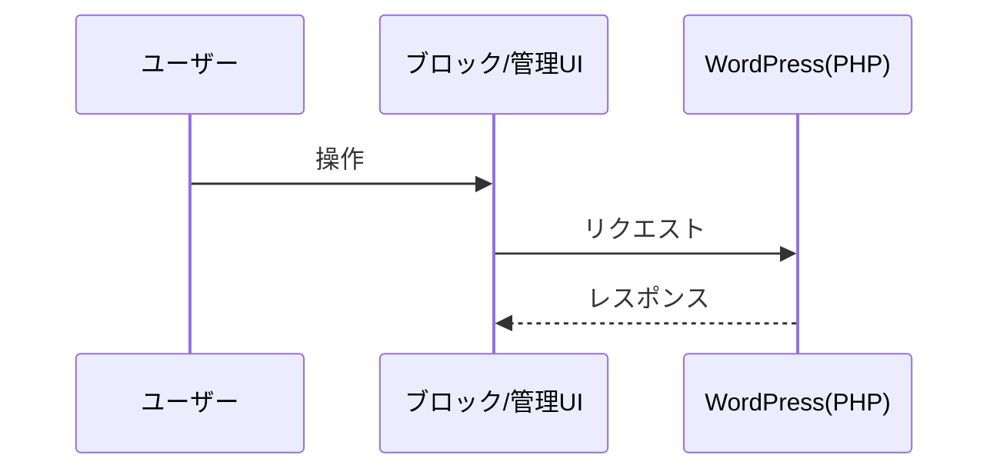

# 機能仕様書テンプレート

## 概要
- 機能名:
- 背景:
- 目的:

## 機能要件
- 要件1:
- 要件2:
- 要件3:

## シーケンス図

## 非機能要件
- セキュリティ:
- 可用性:
- 保守性:

## テストケース
| 内容 | 操作 | 期待値 | 結果 |
|------|------|--------|------|
| 正常系 |  |  | - [ ] |
| 異常系 |  |  | - [ ] |
| エッジケース |  |  | - [ ] |

## 補足
- 影響範囲:
- 参考資料:
